# Лабораторная работа №1
Условие: https://github.com/KeladKaal/containerization-and-orchestration/blob/main-rus/lecture-1-docker/lab.md

# Часть 0
Написал минимальный веб-сервис на Go (стандартная библиотека "net/http"):

**Для "GET /eat?mb=N":**
- Выделяю память через `make([]byte, mb*1024*1024)` — размер в байтах, так как `mb` — это мегабайты.
- Записываю `1` в каждый байт, так как без записи ОС может не дать физическую память, только виртуальную.
- Сохраняю срез в глобальную переменную `heldMemory [][]byte`, для того, чтобы  garbage collector не собрал  память, и она останется занятой на протяжении всей жизни процесса.

**Для "GET /burn":**
- Запускаю бесконечный цикл в горутине, чтобы хендлер сразу вернул ответ, а нагрузка шла в фоне.
- В цикле инкрементирую счётчик, чтобы компилятор не оптимизировал цикл как бесполезный.
- Каждый вызов `/burn` создаёт новую горутину, которая жжёт одно ядро CPU. Остановить их можно только перезапуском сервиса.

# Часть 1 — Запуск напрямую

- На `1.png` сервис запущен напрямую на устройстве, отмечен его PID. Показаны ответы на `/health` (вернул `ok`) и `/eat?mb=100` (вернул `allocated 100 MB, total blocks: 1`).

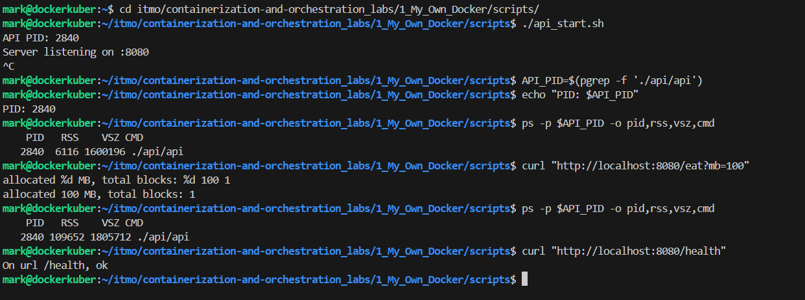


- На `2.png` показано потребление CPU процессом `api` до вызова `/burn`.


- На `3.png` показано потребление CPU процессом `api` после двух вызовов `/burn` — нагрузка выросла примерно на 2 ядра (~200%).


**Проверка `/eat`:** после каждого вызова RSS процесса `api` растёт на указанное количество МБ. Это подтверждает, что память реально выделяется и удерживается.

**Это точка отсчёта: изоляции нет, процесс видит всю систему и может взять сколько угодно ресурсов.**

# Часть 2 — namespaces
**Команды для проверки**:
- hostname
- ip a
- ps aux
- id

## 2.1 Пробую запустить простую команду "ps aux" в новом PID namespace (5.png):
Команда
```
sudo unshare --pid --fork --mount-proc ps aux
```

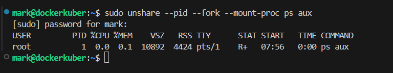

**Анализ**: видно только ps aux. Никаких процессов хоста.

## 2.2 Добавляю остальные namespaces (6.png)
```
sudo unshare --pid --mount --net --uts --ipc --user --fork --mount-proc bash
```
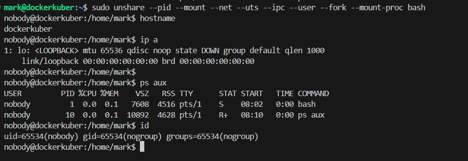
!
- --fork нужен, чтобы unshare форкнул дочерний процесс, который рождается сразу в новом PID namespace. Без него процесс сохраняет старый PID.

- --mount-proc перемонтирует /proc внутри namespace, чтобы ps aux видел только процессы нового namespace. Без него ps читает старый /proc и показывает процессы хоста.

Попадаю в интерактивную оболочку "bash"
Выполню команды для проверки и 
- hostname.  
```
hostname такой же как у хоста, так как процесс стартует с копии hostname хоста. Это как новая папка, в которую скопировали файлы, изоляция есть, но начальное содержимое унаследовано. 
```
- ip a
```
Все хорошо, лишних сетей нет
```
- ps aux
```
Вижу только свои процессы
```
- id
```
id показывает nobody, так как в новом user namespace нет маппинга UID (таблица перевода) — и ядро подставляет nobody (65534) как «UID без маппинга».
```
### Правки
Чтобы увидеть изоляцию надо изменить hostname внутри
```
- hostname mynamespace
- hostname
- exit
- hostname
```
Но при выполнении команды "hostname mynamespace" вылезла ошибка "hostname: you must be root to change the host name". Нужно сделать так, чтобы внутри я был root, а снаружи обычный пользователь, для этого, при создании процесса нужно использовать флаг "--map-root-user" и не использовать sudo.
Исправленный вариант
```
unshare --pid --mount --net --uts --ipc --user --map-root-user --fork --mount-proc bash
```
! Ubuntu 24.04 ограничивает непривилегированные user namespaces через AppArmor. Чтобы unshare --user работал без sudo, нужно разрешить:
```
sudo sysctl -w kernel.apparmor_restrict_unprivileged_userns=0
```

**Проверка**

Терминал 1 (внутри namespace)
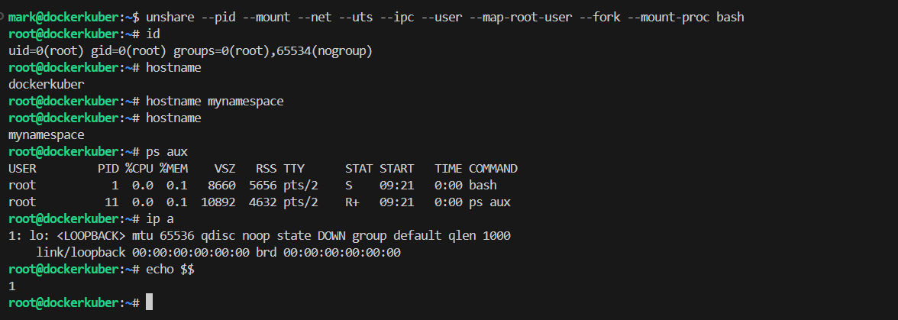
Видно, что 
- в идентификационной информации все хорошо, главное "uid=0(root)"
- hostname изменился после изменений
- ps aux содержит только свои процессы
- сеть пустая и лишних сетей не содержит

Терминал 2 - (вне namespace)
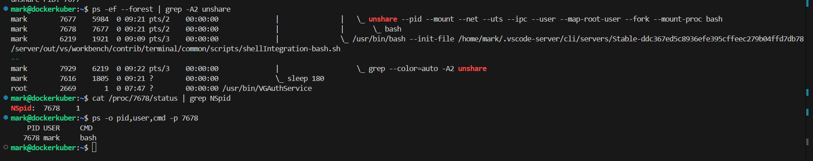
По дереву
```
ps -ef --forest | grep -A2 unshare
```
ищу процесс unshare, их два, unshare — родитель, дочерний bash. И PID **7678** - это внешний PID дочернего bash (который внутри namespace видит себя как PID 1).

Дальше проверяю маппинг PID
```
cat /proc/7678/status | grep NSpid
```
Получил два PID для процесса: снаружи 7678, внутри 1.

Проверил пользователя снаружи
```
ps -o pid,user,cmd -p 7678
``` 
и увидел, что снаружи mark, внутри root

## ДО/ПОСЛЕ
| Параметр |   На хосте    |    В namespace      |
|----------|---------------|---------------------|
| hostname | dockerkuber | mynamespace |
| id | uid=7678(mark) | uid=0(root) |
| ps aux | ~50 процессов | только bash, ps |
| ip a | ens33, lo | только lo |

То есть, ДО изоляции видно имя хоста, id других пользваотелей, куча процессов, а также сеть хоста. ПОСЛЕ - нет 

**Итог:** каждый namespace изолирует свою область:
- **PID** — своя нумерация (bash = PID 1);
- **Mount** — свои точки монтирования;
- **Net** — своя сеть (только `lo`);
- **UTS** — свой hostname;
- **IPC** — свои очереди и семафоры;
- **User** — root внутри, обычный пользователь снаружи; capabilities ограничены namespace.

# Часть 3 — cgroups

## 3.1 cgroups (Введение)
1) Группы находятся по пути `ls /sys/fs/cgroup/`
2) Создание - `sudo mkdir /sys/fs/cgroup/mycgroup`
! Ядро автоматически создаёт внутри неё все файлы управления.
3) Добавление процесса в cgroup - `echo <PID> | sudo tee /sys/fs/cgroup/mycgroup/cgroup.procs`
! Файлы в `/sys/fs/cgroup/` — это интерфейсы ядра, а не обычные текстовые конфиги. Их содержимое — не «настройки в человекочитаемом виде», а сигналы ядру: «добавь этот PID в группу», «установи лимит памяти X байт» и т.д. Поэтому если при создании (touch) и заполнении (nano) файла не через однократную запись (через echo | tee), то поведение будет непредсказуемым: ядро может отвергнуть запись, интерпретировать её иначе или вообще не считать это «командой».
4) Задать лимит, например для RAM - `echo "100M" | sudo tee /sys/fs/cgroup/mycgroup/memory.max` или можно через systemd в unit-файлах
5) Просмотр имеющихся ограничений - `cat /sys/fs/cgroup/mycgroup/` и выбрать, что нужно посмотеть

## 3.2 Выполнение
Буду выполнять через cgroup-менеджер systemd 
Когда systemd запускает сервис (unit), он автоматически создаёт для него cgroup по пути `/sys/fs/cgroup/system.slice/api.service/`, внутри — те же самые файлы (memory.max, cpu.max, pids.max, cgroup.procs), просто systemd создал их сам, не придется делать это вручную
1) Создание unit-файла - `sudo nano /etc/systemd/system/api.service`
2) Заполнить unit-файл
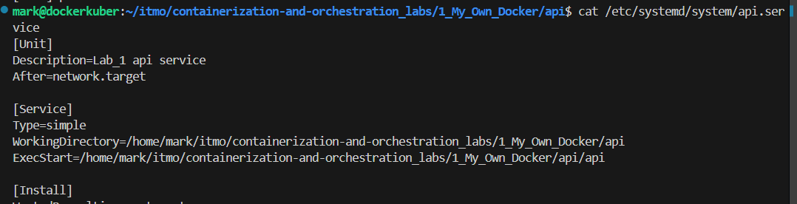
3) Перезагрузить конфиг systemd - `sudo systemctl daemon-reload`
4) Запустить сервис - `sudo systemctl start api.service`
5) Проверка - `sudo systemctl status api.service`

**Проверка**
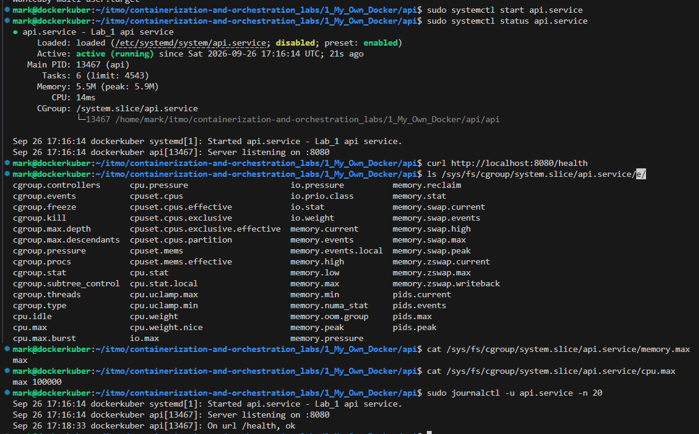
- Сервис запущен и все endpoint работают
- cgroup создано автоматически
- Все файлы созданы без лимитов со значением "max"

## 3.3 Ограничение по памяти
1) Редактирую код unit файла, написанного ранее. Добавляю лимит памяти 200 МБ и запрет swap, для того, чтобы при нахватке памяти процесс не брал запасную память (swap) и сразу сработало ООМ
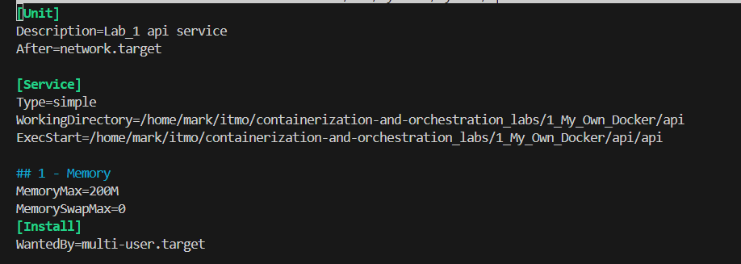
2) Перезапустить daemon-reload, сервис, потом проверить его статус
3) Проверка, что лимиты применились
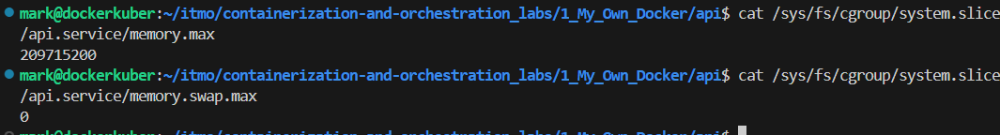
**-> Лимиты по ограничению памяти применены**
4) Проверка на деле
- Запомнил текущее состояние memory.events: 
```cat /sys/fs/cgroup/system.slice/api.service/memory.events```
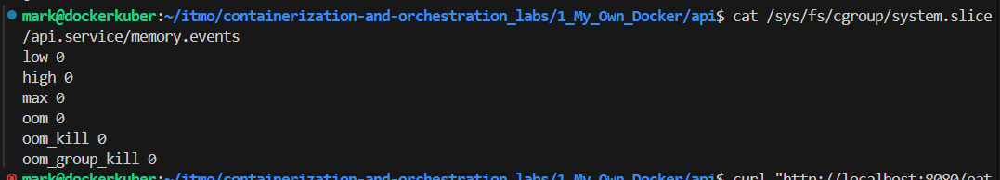
Пока все счетчики 0. Далее отловить не смог, так как после завершения работы сервис все удалеят и автоматически удаляется и memory.events. Но через логи все равно можно увиеть причину завершения
- Вызвать /eat больше чем лимит
```
curl "http://localhost:8080/eat?mb=250"
curl: (52) Empty reply from server
```
5) Провека шага "4)"
- Проверка, что сервис убит ``sudo systemctl status api.service``
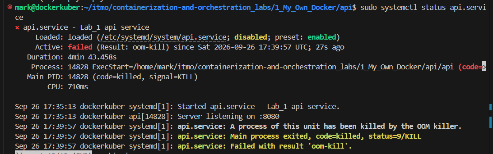
По логам 
```
Sep 26 17:39:57 dockerkuber systemd[1]: api.service: Main process exited, code=killed, status=9/KILL

Sep 26 17:39:57 dockerkuber systemd[1]: api.service: Failed with result 'oom-kill'." 
```
можно сказать, что сервис был завершён (status=9/KILL) по причине нахватки памяти (oom-kill)

- Логи journal, dmesg
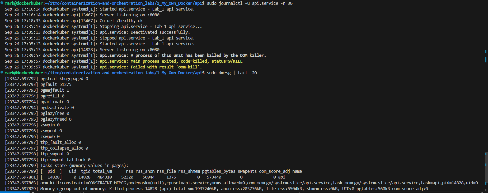
По ним тоже можно увидеть, что сервис заврешил работу из-за нехватки памяти 
```
Sep 26 17:39:57 dockerkuber systemd[1]: api.service: A process of this unit has been killed by the OOM killer.
Sep 26 17:39:57 dockerkuber systemd[1]: api.service: Main process exited, code=killed, status=9/KILL
Sep 26 17:39:57 dockerkuber systemd[1]: api.service: Failed with result 'oom-kill'.

[23347.697803] oom-kill:constraint=CONSTRAINT_MEMCG,nodemask=(null),cpuset=api.service,mems_allowed=0,oom_memcg=/system.slice/api.service,task_memcg=/system.slice/api.service,task=api,pid=14828,uid=0
[23347.697829] Memory cgroup out of memory: Killed process 14828 (api) total-vm:1937240kB, anon-rss:203776kB, file-rss:5504kB, shmem-rss:0kB, UID:0 pgtables:560kB oom_score_adj:0
```

!! systemd подписывается на события cgroup (`/sys/fs/cgroup/system.slice/api.service/memory.events`), на журнал, видит инкремент oom_kill в memory.events и делает вывод «это был OOM».

!! После того, как сервис упал Linux удалил созданную cgroups, так как, чтобы не деражть мусор в ядре, а также потому что cgroup — это контейнер для процессов. Без процессов cgroup пуста, а значит бессмысленна.
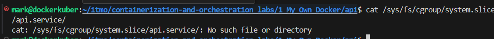

-> **Ограничение по памяти установлено и работает** 

## 3.4 Ограничение по CPU
1) В cgroup v2 лимит CPU задаётся файлом `cpu.max`. Формат: `<quota> <period>`
2) Смотреть статистику `cat /sys/fs/cgroup/system.slice/api.service/cpu.stat`
Там будет указано:
- usage_usec — сколько CPU всего использовано.
- nr_periods — сколько периодов прошло.
- nr_throttled — сколько периодов процесс был throttled.
- throttled_usec — сколько микросекунд процесс провёл в throttled-состоянии.
! Если nr_throttled > 0 — throttling работает.
3) Так как я делаю через unit-файл, то нужно добваить в блок [Service]
```
CPUQuota=50%
CPUQuotaPeriodSec=100
```
4) Проверка
- Перезапустиить daemon-reload, и сам сервис, потом его запустить
- Проверь, что лимит применился
`cat /sys/fs/cgroup/system.slice/api.service/cpu.max`
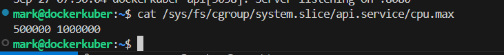
**-> Изменения применились**

- Вызову /burn один раз, процесс хочет занять 100% ядра, но cgroup ограничивает до 50% 
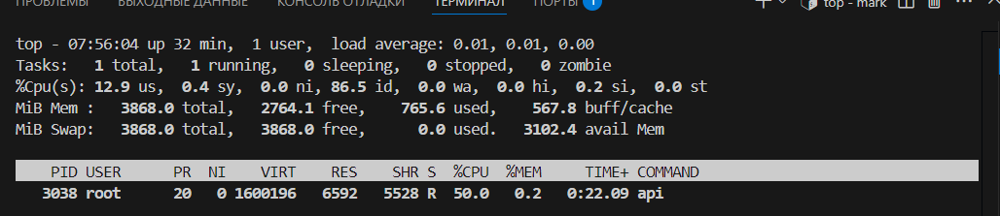

- Вызову /burn еще раз, сумарный запрос уже 200% ядра, но cgroup ограничивает до 50%, как на 

- Смотрю `cpu.stat`: `nr_throttled` растёт — 89 после первого, 271 после второго. Throttling работает.
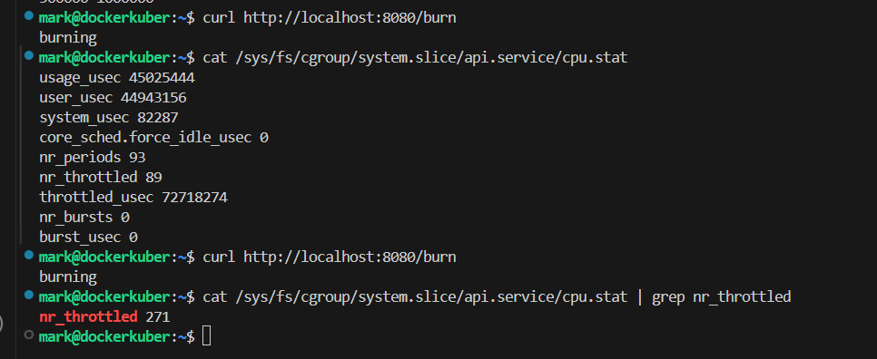


-> **Ограничение по CPU установлено и рабаотет** 

## 3.5 Лимит на процессы
1) Задается в файле `pids.max` - это лимит количества процессов и потоков в cgroup
2) Смотреть статистику:
- `cat /sys/fs/cgroup/system.slice/api.service/pids.max` - указывается лимит процессов, запущенных одновременно
- `cat /sys/fs/cgroup/system.slice/api.service/pids.current` - текущее число процессов
- `cat /sys/fs/cgroup/system.slice/api.service/pids.events` - события 
3) Изменение в unit-файле, в блок `[Service]` добавить - `TasksMax=30`, то есть сейчас указано ограничение в небольше чем 30 процессов одновременно
4) Проверка
- Лимиты применились
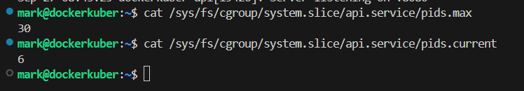
- Запуск fork bomb и проверка
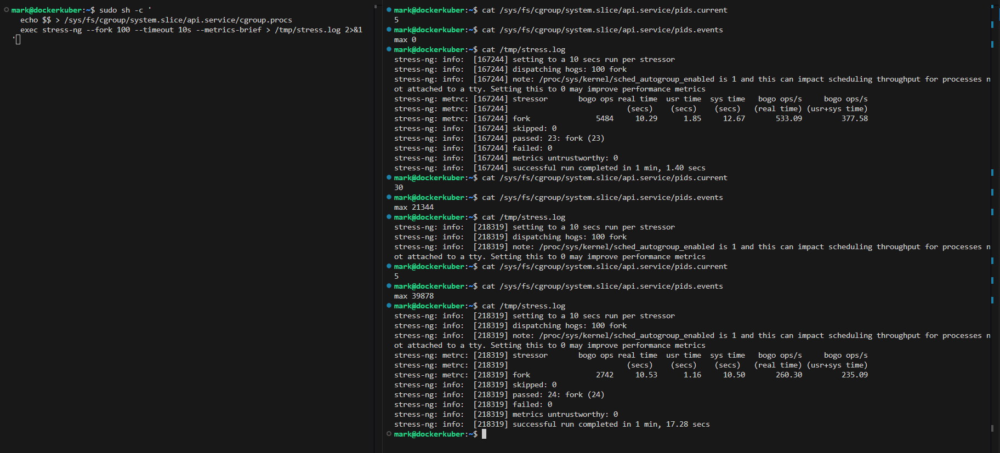
    - В левом терминале я завпускаю stress-ng одной командой и направляю вывод в файл
    - В правом трминале смотрю логи:
        - Сначала до, запуска - текущих процессов - 5, максимально сколько раз cgroup отказала в форках - 0 -> **Все правильно**, а по поводу логов - в момент второго cat стресс ещё шёл, поэтому в логе было только начало. После завершения — полный отчёт.
        - Потом я запустил fork-bomd на 100 процессов, текущих процессов показывает - 30 как и было указано в ограничениях,  max 21344 означает: cgroup 21344 раза отказала в создании нового процесса, потому что pids.current уже был равен pids.max (30). То есть stress-ng пытался форкаться, но упирался в лимит — и получал EAGAIN. Второй прогон добавил ещё поэтому второй просмотр  `cat /sys/fs/cgroup/system.slice/api.service/pids.events` показал `max 39878`, так как счётчик pids.events не сбрасывается пока группа существует
        - После завершения работы fork-bomd текущее код-в процессов вернулось к исходным 5 процессам
        - Также в логах `/tmp/stress.log`, то, что `passed: 23` (а не 100) — косвенное доказательство: stress-ng хотел запустить 100 форков, но смог удержать только 23–24 одновременно. Остальные получали EAGAIN.

-> **Ограничение по процессам установлено и рабаотет**

# Часть 4 — права

## 4.1 capabilities
1) Capabilities — определяет права, что процесс может делать в принципе. Разделение root права на отдельные права, вместо "Всё или ничего" - разделенные разрешения
2) Их можео натйи так: `cat /proc/<PID>/status | grep Cap`, можно увидеть поля:
```
- CapInh — inherited (наследуемые).
- CapPrm — permitted (разрешённые).
- CapEff — effective (действующие сейчас).
- CapBnd — bounding set (максимально возможный набор).
```
! Расшифровать в список: `capsh --decode=000001ffffffffff`
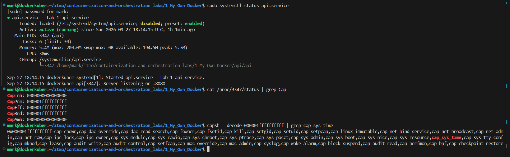
**Анализ** у процесса одинаковый список разрешённых действующих сейчас правил, также сейчас доступно правило `cap_sys_time ` - для смены времени
! Срез capabilities позволяет дать только те права сервису, которые ему нужны, без этого, елси злоумышленник скомпрометирует твой сервис с полными capabilities, то он получит полный контроль на системой, а при обрезанных правах к критически важным правам не получит доступ

## 4.2 seccomp
1) Seccomp (Secure Computing Mode) — это фильтр системных вызовов. Процесс объявляет: «мне разрешены только syscall'ы X, Y а на всё остальное — либо ошибка, либо SIGKILL».
2) **От чего защищает:** некоторые syscall'ы не требуют специальных capabilities, но через них можно навредить. Например:
- `ptrace` — чтение памяти чужих процессов, кража секретов.
- `mount` — монтирование файловых систем.
- `bpf` — программирование ядра (eBPF).
- `kexec_load` — загрузка своего ядра.

Capabilities эти вызовы не закрывают. Seccomp — закрывает.
 
## 4.3 Реализация
1) Так как натсройка сервиса идет через unit-файл, то  в [Service] добвалю:
- `CapabilityBoundingSet=CAP_NET_BIND_SERVICE` - Сбрасываем все capabilities, кроме нужных. Остается право слушать порты < 1024. Всё остальное (включая CAP_SYS_TIME) срезано.
- `NoNewPrivileges=yes` - запрет на получение новых привилегий (setuid-бинарники). Даже если внутри контейнера есть sudo, он не сработает.
- `SystemCallFilter=@system-service`- разрешается только «безопасный» набор syscall'ов, который systemd считает нужным для сервисов.
- `SystemCallErrorNumber=EPERM` -  при запрещённом syscall возвращаем EPERM (Operation not permitted), а не убиваем процесс (для отладки)
2) Проверка
- Ограничения применены, сейчас доступно только cap_net_bind_service (бит 10)
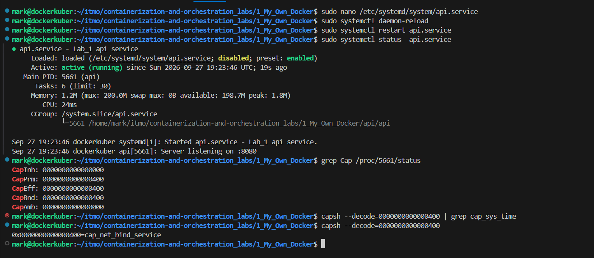
- Пробую запрещеное действие - смена времени
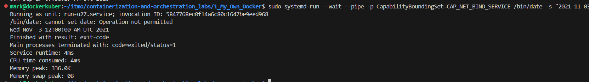
-> Интересуют строка `cannot set date: Operation not permitted`
- Доказательство, что seccomp реально применён, а не только в конфиге написан.
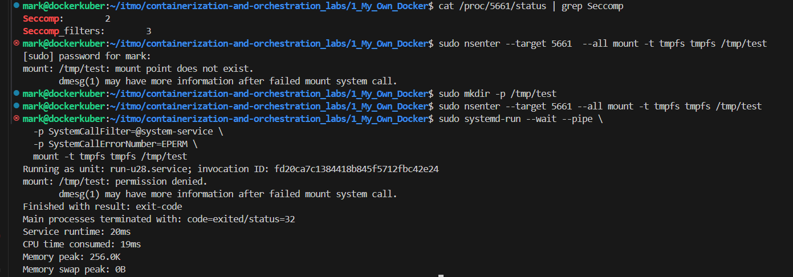

Seccomp: 2 означает filter mode — seccomp-фильтр активен для этого процесса. 

Также `mount: /tmp/test: permission denied.`

-> **Процессу оствлены только нужный минимум прав**

**Общий вывод:**
Capabilities и seccomp — **разные слои**:
- **Capabilities** — про **права**: что процесс может делать (менять время, сеть, монтировать).
- **Seccomp** — про **системные вызовы**: какие «двери в ядро» процесс может открыть.

Пример: `ptrace` не требует capabilities. Даже с урезанным набором capabilities атакующий мог бы его вызвать. Но seccomp блокирует `ptrace`, потому что он не входит в `@system-service`.

Вместе они дают **defense-in-depth**: если один слой пробит — второй остановит.

# Часть 5 — Собрать свой Docker
1) Написание скрипта
Ключевые приципы
- 
-
2) Проверка
- 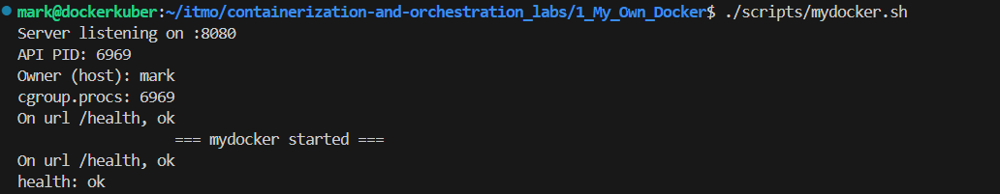

**Вывод:** скприет работает статус ок вовразается
- 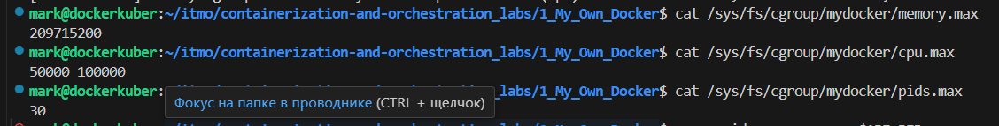

**Вывод:** Лимиты применились
- 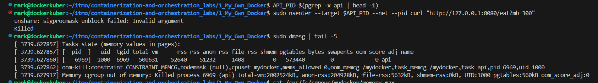

**Вывод:**

- constraint=CONSTRAINT_MEMCG — убито из-за cgroup-лимита памяти, а не из-за глобального OOM. Значит лимит реально применился.

    - oom_memcg=/mydocker — OOM случился внутри cgroup mydocker, которую и создавал.
    - task_memcg=/mydocker — процесс был в этой cgroup.
    - UID:1000 — снаружи процесс от mark, не root. Иллюзия работает.
    - anon-rss:204928kB ≈ 200 МБ — процесс дошёл до лимита 200 МБ и был убит.

- 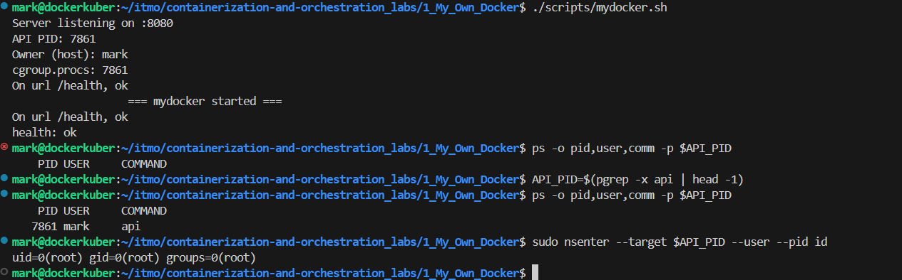

**Вывод:** Иллюзия власти раюотает, снуружи обычный мользваоель, внутри root