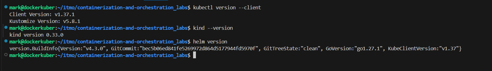
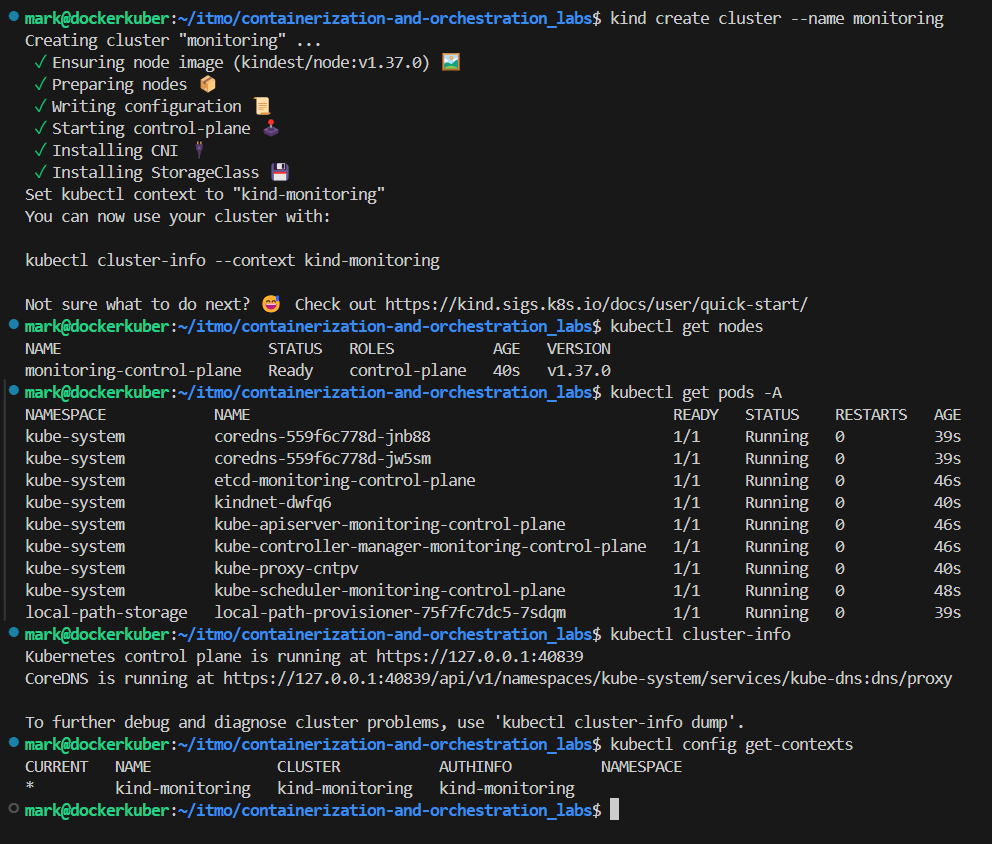
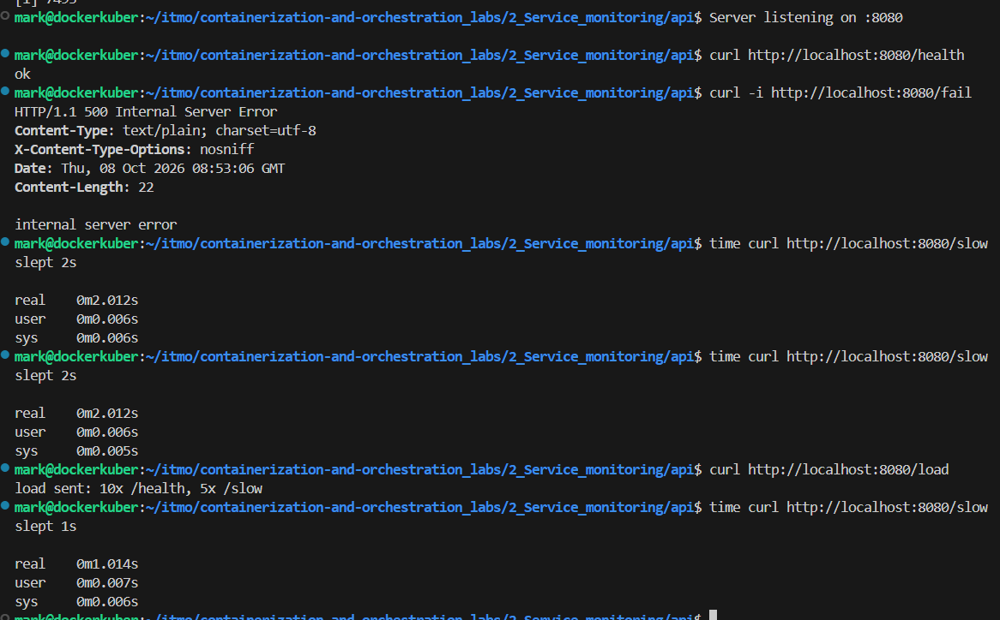

# Лабораторная работа №2 - Мониторинг сервиса: метрики, логи, трейсы
Условие: https://github.com/KeladKaal/containerization-and-orchestration/blob/main-rus/lecture-2-observability/lab.md

# Ситуация
Нужно поднять полный мониторинг одного сервиса: метрики, логи и трейсы. Метрики и логи смотришь в Grafana, трейсы — в Jaeger, алерты — в Alertmanager. Этот стек соберается один раз дальше будет переиспользоваться.

# Часть 00 — Начальная настройка
1. Нужные программы

-> Все установлено и готово к работе

2. Создание и настройка кластера kind

**Анализ:**
- Кластер создан 
- Кластер поднялся, он содежит одну нода Ready и кучу системных подов в kube-system
- kubectl видит кластер kind - контекст kind-monitoring

# Часть 0 - Свой сервис
Создание сервиса с четырьмя эндпоинтами. Без метрик, без JSON-логов, без OTel. Просто рабочий HTTP-сервер, который можно дёргать.

-> Все эндпоинты работают 